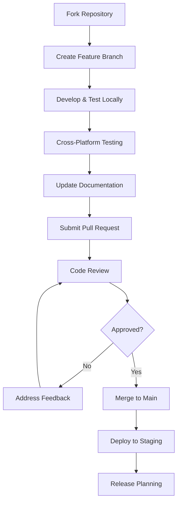

# 🤝 Contributing to EtherVoxAI

Thank you for your interest in contributing to EtherVoxAI—a privacy-first, multilingual voice AI platform designed for ambient intelligence across multiple platforms.

*By contributing, you agree that your work is released under [CC BY-NC-SA 4.0](LICENSE). Commercial redistribution requires separate approval.*

## 🎯 Ways to Contribute

### 🐛 Bug Reports
- Use the [bug report template](.github/ISSUE_TEMPLATE/bug_report.md)
- Include platform information, steps to reproduce, and expected behavior
- Test across multiple platforms when possible
- Include logs and system information

### 💡 Feature Requests  
- Use the [feature request template](.github/ISSUE_TEMPLATE/feature_request.md)
- Explain the use case and expected benefit
- Consider privacy and cross-platform implications
- Provide mockups or examples when helpful

### 🔧 Code Contributions
- **Core System**: Audio processing, dialogue engine, platform abstraction
- **SDK Development**: Plugin system, model routing, device profiles
- **Dashboard**: Web interface improvements and new features
- **Documentation**: API docs, tutorials, examples
- **Testing**: Unit tests, integration tests, cross-platform validation

### 🌍 Localization
- **Language Support**: Add new language models and configurations
- **UI Translation**: Dashboard and documentation translation
- **Cultural Adaptation**: Locale-specific optimizations

## 🛠️ Development Environment Setup

### Prerequisites

#### For All Development
```bash
# Required tools
sudo apt update
sudo apt install build-essential cmake git nodejs npm python3

# Clone the repository
git clone https://github.com/ethervox-ai/ethervoxai.git
cd ethervoxai
git submodule update --init --recursive
```

#### For ESP32 Development
```bash
# Install ESP-IDF
mkdir -p ~/esp
cd ~/esp
git clone --recursive https://github.com/espressif/esp-idf.git
cd esp-idf
./install.sh esp32s3
. ./export.sh

# Add to your ~/.bashrc
echo 'alias get_idf=". $HOME/esp/esp-idf/export.sh"' >> ~/.bashrc
```

#### For Raspberry Pi Cross-Compilation
```bash
# Install ARM toolchain
sudo apt install gcc-arm-linux-gnueabihf g++-arm-linux-gnueabihf

# Install WiringPi for GPIO (on target device)
sudo apt install wiringpi
```

#### For Windows Development
```powershell
# Using chocolatey
choco install cmake mingw nodejs git

# Or using Visual Studio with CMake support
# Download Visual Studio Community with C++ workload
```

### Build Configuration

#### Desktop Build (Development)
```bash
mkdir build && cd build
cmake -DCMAKE_BUILD_TYPE=Debug -DBUILD_TESTS=ON ..
make -j$(nproc)
```

#### Cross-Platform Builds
```bash
# ESP32
cmake -DCMAKE_TOOLCHAIN_FILE=cmake/esp32.cmake ..
make

# Raspberry Pi
cmake -DCMAKE_TOOLCHAIN_FILE=cmake/rpi.cmake ..  
make

# Windows (from Linux)
cmake -DCMAKE_TOOLCHAIN_FILE=cmake/windows.cmake ..
make
```

#### Dashboard Development
```bash
cd dashboard
npm install
npm run dev    # Development server
npm run build  # Production build
npm run test   # Run tests
```

## 📝 Code Style Guidelines

### C/C++ Code Style

#### Naming Conventions
```c
// Functions: snake_case with ethervox prefix
int ethervox_audio_init(ethervox_audio_runtime_t* runtime);

// Types: snake_case with _t suffix
typedef struct ethervox_device_profile_t ethervox_device_profile_t;

// Constants: UPPER_SNAKE_CASE with ETHERVOX prefix  
#define ETHERVOX_MAX_CHANNELS 8

// Variables: snake_case
uint32_t sample_rate = 48000;
bool is_initialized = false;
```

#### Code Organization
```c
// Header structure
#ifndef ETHERVOX_MODULE_H
#define ETHERVOX_MODULE_H

#ifdef __cplusplus
extern "C" {
#endif

// Includes, defines, types, function declarations

#ifdef __cplusplus
}
#endif

#endif // ETHERVOX_MODULE_H

// Implementation structure  
#include "ethervox/module.h"
#include <standard_headers>
#include "local_headers"

// Static functions first
static int internal_function(void);

// Public API functions
int ethervox_module_init(void) {
    // Implementation
}
```

#### Documentation
```c
/**
 * @brief Initialize the audio runtime system
 * @param runtime Pointer to audio runtime structure
 * @param language Primary language for STT/TTS
 * @return 0 on success, negative error code on failure
 * 
 * This function initializes platform-specific audio drivers and 
 * sets up STT/TTS engines for the specified language. Must be 
 * called before any other audio operations.
 * 
 * @note This function is not thread-safe during initialization
 * @see ethervox_audio_cleanup()
 */
int ethervox_audio_init(ethervox_audio_runtime_t* runtime, 
                       ethervox_language_t language);
```

### JavaScript/Vue.js Style

#### Naming Conventions
```javascript
// Components: PascalCase
export default {
  name: 'AudioControls',
}

// Variables: camelCase
const sampleRate = 48000;
const isRecording = false;

// Constants: UPPER_SNAKE_CASE
const MAX_RECORDING_TIME = 30000;

// Files: kebab-case
// audio-controls.vue
// system-metrics.js
```

#### Vue.js Patterns
```vue
<template>
  <div class="audio-controls">
    <!-- Use semantic HTML -->
    <button 
      :disabled="!isInitialized"
      @click="toggleRecording"
      class="btn-primary"
    >
      {{ isRecording ? 'Stop' : 'Start' }} Recording
    </button>
  </div>
</template>

<script setup>
import { ref, computed, onMounted } from 'vue'
import { useAudioStore } from '@/stores/audio'

// Composition API preferred
const audioStore = useAudioStore()
const isRecording = ref(false)

// Computed properties for reactive data
const buttonText = computed(() => 
  isRecording.value ? 'Stop Recording' : 'Start Recording'
)
</script>

<style scoped>
/* Scoped styles preferred */
.audio-controls {
  @apply flex items-center space-x-4;
}

.btn-primary {
  @apply bg-blue-500 hover:bg-blue-600 text-white px-4 py-2 rounded;
}
</style>
```

## 🧪 Testing Guidelines

### Unit Testing

#### C/C++ Tests (using simple framework)
```c
#include "test_framework.h"
#include "ethervox/audio.h"

void test_audio_init_success(void) {
    ethervox_audio_runtime_t runtime = {0};
    int result = ethervox_audio_init(&runtime, ETHERVOX_LANG_ENGLISH);
    
    assert_equals(result, 0, "Audio init should succeed");
    assert_true(runtime.is_initialized, "Runtime should be marked initialized");
    
    ethervox_audio_cleanup(&runtime);
}

void test_audio_init_null_pointer(void) {
    int result = ethervox_audio_init(NULL, ETHERVOX_LANG_ENGLISH);
    assert_equals(result, -1, "Should fail with null pointer");
}

int main(void) {
    run_test(test_audio_init_success);
    run_test(test_audio_init_null_pointer);
    return test_results();
}
```

#### JavaScript Tests (Vitest)
```javascript
import { describe, it, expect, vi } from 'vitest'
import { useAudioStore } from '@/stores/audio'

describe('Audio Store', () => {
  it('should initialize with default state', () => {
    const store = useAudioStore()
    expect(store.isRecording).toBe(false)
    expect(store.volume).toBe(0.5)
  })

  it('should toggle recording state', async () => {
    const store = useAudioStore()
    await store.toggleRecording()
    expect(store.isRecording).toBe(true)
  })
})
```

### Integration Testing

#### Cross-Platform Testing
```bash
#!/bin/bash
# scripts/test_platforms.sh

echo "Testing cross-platform builds..."

# Test ESP32 build
echo "Building for ESP32..."
mkdir -p build-esp32
cd build-esp32
cmake -DCMAKE_TOOLCHAIN_FILE=../cmake/esp32.cmake ..
make || exit 1
cd ..

# Test Raspberry Pi build  
echo "Building for Raspberry Pi..."
mkdir -p build-rpi
cd build-rpi
cmake -DCMAKE_TOOLCHAIN_FILE=../cmake/rpi.cmake ..
make || exit 1
cd ..

echo "All platform builds successful!"
```

#### System Integration Tests
```c
// Test complete voice processing pipeline
void test_voice_pipeline_integration(void) {
    // Initialize all subsystems
    ethervox_audio_runtime_t audio = {0};
    ethervox_dialogue_engine_t dialogue = {0};
    ethervox_sdk_t sdk = {0};
    
    assert_success(ethervox_audio_init(&audio, ETHERVOX_LANG_ENGLISH));
    assert_success(ethervox_dialogue_init(&dialogue));  
    assert_success(ethervox_sdk_init(&sdk));
    
    // Test audio processing
    const char* test_audio = load_test_audio("hello_world.wav");
    char transcript[256];
    assert_success(ethervox_audio_process(&audio, test_audio, 1024, transcript));
    
    // Test intent recognition
    ethervox_intent_result_t result;
    assert_success(ethervox_dialogue_parse_intent(&dialogue, transcript, &result));
    assert_equals(result.type, ETHERVOX_INTENT_GREETING);
    
    // Cleanup
    ethervox_audio_cleanup(&audio);
    ethervox_dialogue_cleanup(&dialogue);
    ethervox_sdk_cleanup(&sdk);
}
```

## 🚀 Pull Request Process

### Before Submitting

1. **Create Feature Branch**
```bash
git checkout main
git pull origin main  
git checkout -b feature/your-feature-name
```

2. **Make Changes**
- Follow code style guidelines
- Add tests for new functionality
- Update documentation as needed
- Ensure cross-platform compatibility

3. **Test Thoroughly**
```bash
# Run all tests
make test

# Test cross-platform builds
./scripts/test_platforms.sh

# Test dashboard
cd dashboard && npm test
```

4. **Update Documentation**
- API changes require documentation updates
- Add examples for new features
- Update changelog with notable changes

### Submitting the PR

1. **Push Feature Branch**
```bash
git add .
git commit -m "feat: add voice command batching support"
git push origin feature/your-feature-name
```

2. **Create Pull Request**
- Use the PR template
- Link related issues
- Provide detailed description
- Include testing evidence
- Add screenshots for UI changes

3. **Address Review Feedback**
- Respond to all review comments
- Make requested changes promptly  
- Test changes after modifications
- Request re-review when ready

### PR Requirements

#### Commit Message Format
```
type(scope): brief description

Longer description explaining what and why (not how).
Can span multiple lines.

Fixes #123
```

**Types**: `feat`, `fix`, `docs`, `style`, `refactor`, `test`, `chore`
**Scopes**: `audio`, `dialogue`, `platform`, `dashboard`, `sdk`, `build`

#### Quality Checklist
- [ ] Code follows style guidelines  
- [ ] Tests added for new functionality
- [ ] All tests pass locally
- [ ] Documentation updated
- [ ] Cross-platform compatibility verified
- [ ] No breaking changes (or properly documented)
- [ ] Privacy implications considered

## 🏗️ Project Architecture

### Core Components

#### Audio Runtime (`src/audio/`)
- Platform-specific audio drivers (ALSA, WaveAPI, I2S)
- STT/TTS integration with offline models
- Noise suppression and echo cancellation
- Multi-language audio processing

#### Dialogue Engine (`src/dialogue/`)  
- Intent recognition and entity extraction
- LLM integration and routing
- Conversation context management
- Multi-language natural language understanding

#### Platform Layer (`src/platform/`)
- Hardware abstraction layer (GPIO, I2C, SPI)
- Power management and system control
- Platform-specific optimizations
- Device capability detection

#### Plugin System (`src/plugins/`)
- Dynamic plugin loading and management
- Built-in integrations (OpenAI, HuggingFace, RAG)
- External API routing and fallback
- Plugin lifecycle and statistics

#### SDK (`sdk/`)
- Developer API for extensions
- Intent plugin framework
- Model router architecture  
- Device profile system
- Comprehensive examples

#### Dashboard (`dashboard/`)
- Vue.js 3 web interface
- Real-time system monitoring
- Privacy-first configuration
- Responsive design

### Development Workflow



## 🌍 Multi-Language Contributions

### Adding Language Support

#### 1. Language Configuration
```c
// Add to include/ethervox/config.h
typedef enum {
    ETHERVOX_LANG_ENGLISH = 0,
    ETHERVOX_LANG_SPANISH,
    ETHERVOX_LANG_CHINESE,
    ETHERVOX_LANG_FRENCH,    // New language
    ETHERVOX_LANG_MAX
} ethervox_language_t;
```

#### 2. Audio Models
```bash
# Add language-specific models
models/
├── whisper-base-en.bin      # English
├── whisper-base-es.bin      # Spanish  
├── whisper-base-zh.bin      # Chinese
└── whisper-base-fr.bin      # French (new)
```

#### 3. Intent Patterns
```c
// src/dialogue/intent_fr.c
static const char* french_greetings[] = {
    "bonjour", "salut", "bonsoir", "bonne nuit", NULL
};

static const char* french_commands[] = {
    "allume", "éteins", "augmente", "diminue", NULL  
};
```

#### 4. Dashboard Localization
```javascript
// dashboard/src/locales/fr.json
{
  "dashboard.title": "Tableau de Bord EtherVox",
  "audio.recording": "Enregistrement",
  "system.status": "État du Système",
  "privacy.settings": "Paramètres de Confidentialité"
}
```

### Translation Guidelines

1. **Technical Accuracy**: Ensure technical terms are correctly translated
2. **Cultural Context**: Consider cultural differences in interaction patterns  
3. **Consistency**: Use consistent terminology across all materials
4. **Testing**: Test voice recognition with native speakers
5. **Documentation**: Update all language-specific documentation

## 🔒 Security Considerations

### Code Security

#### Input Validation
```c
// Always validate inputs
int ethervox_process_text(const char* text) {
    if (!text || strlen(text) == 0) {
        return -EINVAL;
    }
    
    if (strlen(text) > MAX_TEXT_LENGTH) {
        return -E2BIG;
    }
    
    // Process validated input
    return process_validated_text(text);
}
```

#### Memory Safety
```c
// Use safe string functions
char buffer[256];
strncpy(buffer, input, sizeof(buffer) - 1);
buffer[sizeof(buffer) - 1] = '\0';

// Check allocations
char* data = malloc(size);
if (!data) {
    return -ENOMEM;
}
// Use data...
free(data);
data = NULL;
```

#### API Key Handling
```c
// Never log sensitive data
void log_api_request(const char* endpoint, const char* key) {
    // WRONG: log_info("API request to %s with key %s", endpoint, key);
    
    // CORRECT: 
    char masked_key[32];
    snprintf(masked_key, sizeof(masked_key), "%.4s****", key);
    log_info("API request to %s with key %s", endpoint, masked_key);
}
```

### Privacy Protection

#### Data Minimization
- Only collect data necessary for functionality
- Implement automatic data expiration
- Provide user control over data retention
- Document all data flows clearly

#### Consent Management
```javascript
// dashboard/src/stores/privacy.js
export const usePrivacyStore = defineStore('privacy', {
  state: () => ({
    consentGiven: {
      audioRecording: false,
      cloudProcessing: false,
      analytics: false
    }
  }),
  
  actions: {
    async requestConsent(type, purpose) {
      // Show clear consent dialog
      const granted = await showConsentDialog(type, purpose);
      this.consentGiven[type] = granted;
      return granted;
    }
  }
});
```

## 🎨 UI/UX Contributions

### Design Principles

1. **Privacy-First**: Make privacy settings prominent and understandable
2. **Accessibility**: Support screen readers, keyboard navigation, color blindness
3. **Cross-Platform**: Responsive design that works on all device sizes
4. **Performance**: Fast loading, smooth interactions, efficient updates
5. **Clarity**: Clear visual hierarchy, intuitive navigation, helpful feedback

### Component Guidelines

```vue
<!-- Good: Clear, accessible, consistent -->
<template>
  <div class="audio-control" role="region" aria-label="Audio Controls">
    <button
      :aria-pressed="isRecording"
      :disabled="!isReady"
      @click="toggleRecording"
      class="btn-primary"
    >
      <Icon :name="isRecording ? 'stop' : 'microphone'" />
      <span>{{ isRecording ? 'Stop' : 'Start' }} Recording</span>
    </button>
    
    <div 
      v-if="isRecording" 
      class="recording-indicator"
      aria-live="polite"
    >
      Recording... {{ formatTime(recordingDuration) }}
    </div>
  </div>
</template>
```

### Accessibility Requirements

- **WCAG 2.1 AA Compliance**: All UI components must meet accessibility standards
- **Keyboard Navigation**: Full functionality via keyboard
- **Screen Reader Support**: Proper ARIA labels and semantic HTML
- **Color Contrast**: Minimum 4.5:1 contrast ratio for text
- **Focus Management**: Clear focus indicators and logical tab order

## 📊 Performance Guidelines

### C/C++ Performance

#### Memory Efficiency
```c
// Use stack allocation when possible
char small_buffer[256];  // Stack

// Pool allocation for frequent operations
typedef struct {
    char buffers[MAX_CONCURRENT][BUFFER_SIZE];
    bool in_use[MAX_CONCURRENT];
} buffer_pool_t;

// Avoid frequent malloc/free in hot paths
```

#### CPU Optimization
```c
// Cache-friendly data structures
typedef struct {
    // Group frequently accessed fields together
    bool is_active;
    uint32_t sample_rate;
    uint32_t channels;
    
    // Less frequently accessed fields at end
    char description[256];
} audio_config_t;

// Use appropriate data types
uint8_t flags;     // Not int for single byte values
uint32_t count;    // Not uint64_t unless needed
```

### JavaScript Performance

#### Reactive Data
```javascript
// Efficient reactive patterns
const audioMetrics = ref({
  volume: 0,
  frequency: 0,
  timestamp: 0
});

// Update efficiently 
const updateMetrics = (newData) => {
  Object.assign(audioMetrics.value, newData);
};

// Avoid frequent reactive updates
const debouncedUpdate = debounce(updateMetrics, 100);
```

#### Component Optimization
```vue
<script setup>
// Use computed for expensive calculations
const processedAudio = computed(() => {
  return expensiveAudioProcessing(rawAudio.value);
});

// Memoize expensive operations
const memoizedTransform = computed(() => {
  return useMemoize(() => 
    transformAudioData(audioMetrics.value),
    [audioMetrics.value.timestamp]
  );
});
</script>
```

## 🐛 Debugging Guidelines

### Debug Build Configuration
```bash
# Enable debug symbols and sanitizers
cmake -DCMAKE_BUILD_TYPE=Debug \
      -DENABLE_ASAN=ON \
      -DENABLE_UBSAN=ON \
      -DENABLE_LOGGING=ON \
      ..
```

### Logging Best Practices
```c
// Use structured logging
#define LOG_AUDIO(level, format, ...) \
    ethervox_log(level, "AUDIO", "[%s:%d] " format, \
                __FUNCTION__, __LINE__, ##__VA_ARGS__)

// Different log levels for different purposes
LOG_AUDIO(DEBUG, "Processing %d samples", sample_count);
LOG_AUDIO(INFO, "Audio system initialized");
LOG_AUDIO(WARN, "Buffer underrun detected");
LOG_AUDIO(ERROR, "Failed to open audio device: %s", error_msg);
```

### Memory Debugging
```bash
# Valgrind for memory leaks
valgrind --leak-check=full --track-origins=yes ./ethervoxai

# AddressSanitizer for runtime errors  
export ASAN_OPTIONS=abort_on_error=1:fast_unwind_on_malloc=0
./ethervoxai
```

## 📈 Performance Testing

### Benchmarking
```c
#include <time.h>

uint64_t benchmark_function(void) {
    struct timespec start, end;
    clock_gettime(CLOCK_MONOTONIC, &start);
    
    // Function to benchmark
    int result = ethervox_process_audio(data, size);
    
    clock_gettime(CLOCK_MONOTONIC, &end);
    
    uint64_t duration_ns = (end.tv_sec - start.tv_sec) * 1000000000UL + 
                          (end.tv_nsec - start.tv_nsec);
    
    printf("Function took %lu ns (result: %d)\n", duration_ns, result);
    return duration_ns;
}
```

### Load Testing
```javascript
// Dashboard load testing
async function loadTest() {
  const concurrent = 10;
  const requests = Array.from({length: concurrent}, async (_, i) => {
    const start = performance.now();
    await simulateUserInteraction();
    const end = performance.now();
    return {id: i, duration: end - start};
  });
  
  const results = await Promise.all(requests);
  const avgDuration = results.reduce((sum, r) => sum + r.duration, 0) / concurrent;
  
  console.log(`Average response time: ${avgDuration}ms`);
}
```

## 📋 Release Process

### Version Numbering
- **Major.Minor.Patch** (e.g., 1.2.3)
- **Major**: Breaking changes
- **Minor**: New features, backward compatible
- **Patch**: Bug fixes, backward compatible

### Release Checklist
- [ ] All tests pass on all platforms
- [ ] Documentation updated
- [ ] Changelog updated  
- [ ] Version numbers updated
- [ ] Security review completed
- [ ] Performance regression testing
- [ ] Translation updates
- [ ] Release notes prepared

## 🎉 Recognition

Contributors who make significant impacts will be recognized in:

- **README Hall of Fame**: Major contributors featured in README
- **Release Notes**: Contributors credited in each release
- **Annual Report**: Yearly recognition of top contributors
- **Swag & Merchandise**: EtherVoxAI contributor items

## 📞 Getting Help

### Community Support
- **GitHub Discussions**: [Ask questions and share ideas](https://github.com/ethervox-ai/ethervoxai/discussions)
- **Discord Server**: Real-time chat with maintainers and contributors
- **Stack Overflow**: Tag questions with `ethervoxai`

### Documentation
- **Wiki**: Community-maintained documentation and tutorials
- **API Reference**: Complete API documentation with examples
- **Video Tutorials**: Step-by-step development guides

### Direct Contact
- **Maintainer Email**: maintainers@ethervox.ai
- **Security Issues**: security@ethervox.ai (private disclosure)
- **Partnership Inquiries**: partnerships@ethervox.ai

---

## 🙏 Thank You

Your contributions make EtherVoxAI better for everyone. Whether you're fixing a typo, adding a feature, or helping other users, every contribution matters.

**Together, we're building the future of privacy-first voice AI! 🚀**
...
